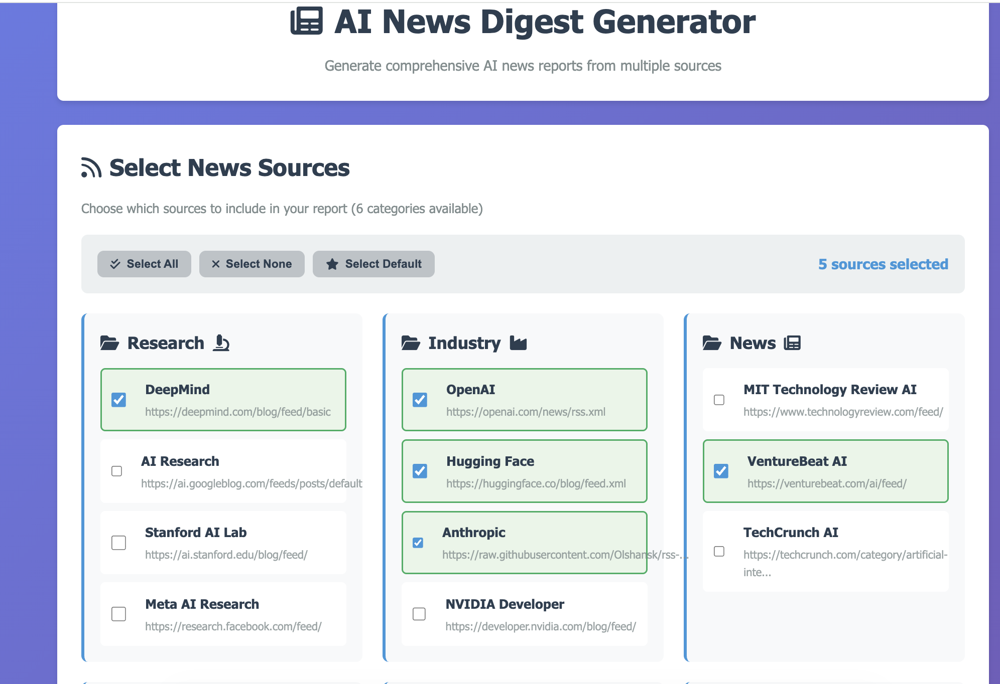

# AI News Digest



Staying current on AI research and industry news means scanning dozens of
sources daily -- blogs, research labs, company announcements -- and figuring
out what actually matters. Most of it is noise.

AI News Digest aggregates 19+ curated AI/ML sources, uses LLM-powered analysis
to score each article by impact, and generates structured digest reports with
executive summaries and trend analysis. One click, one report, every morning.

## Why I built this

I was spending 30+ minutes daily scanning AI news across scattered sources.
I wanted to explore three product questions:

1. **Can AI reliably score "what matters" in a news feed?** Multi-dimensional
   impact scoring (1-10) with automatic categorization -- turning a firehose
   of articles into a ranked, actionable digest.
2. **What does a useful AI-generated report look like?** Not just summaries,
   but cross-article trend analysis, market implications, and executive
   overviews that surface patterns humans miss when reading one article at a time.
3. **How do you build a reliable daily pipeline?** RSS feed health monitoring,
   intelligent caching to avoid reprocessing, rate limiting to stay within
   API budgets, and duplicate detection across sources.

## Quick start

```bash
# Clone and install
git clone https://github.com/spalit2025/AI-news-digest.git
cd AI-news-digest
pip install -r requirements.txt

# Configure
cp .env.example .env
# Edit .env with your FIREWORKS_API_KEY

# Launch
python app.py
# Open http://localhost:8080
```

Click "Generate Report" and watch real-time progress as it fetches, analyzes,
and compiles the digest.

## How it works

```
19+ RSS Feeds (DeepMind, OpenAI, Anthropic, HuggingFace, NVIDIA, Google AI...)
    |
    | fetch_rss_articles() -- parallel fetch + parse
    |
Feed Validation + Dedup
    |
    +-- Feed health monitoring (track reliability per source)
    +-- StateTracker (skip already-processed articles via JSON persistence)
    |
Content Extraction
    |
    +-- BeautifulSoup HTML parsing with fallback to RSS description
    |
AI Analysis (Fireworks API -- Llama-4 Scout)
    |
    +-- Impact scoring (1-10, multi-dimensional)
    +-- Categorization (research, product, funding, policy, etc.)
    +-- Market analysis (business implications, investment signals)
    +-- Trend synthesis (cross-article patterns)
    |
Report Generator (ReportLab)
    |
    +-- Web UI (real-time progress, interactive dashboard)
    +-- PDF export (executive summary, full analysis, trend map)
```

## Architecture

```
app.py                  Flask web app, routes, pipeline orchestration
rss_feeds.py            RSS feed config, fetching, validation, state tracking
summarization.py        LLM-powered analysis, scoring, JSON parsing
ui.py                   PDF report generation (ReportLab)
templates/index.html    Web interface with real-time progress
static/                 CSS and JavaScript
tests/                  pytest suite (74 tests, 77% coverage)
```

## Key design decisions

- **Impact scoring over chronological listing:** Raw feeds are noisy. A scored,
  ranked digest surfaces the 5 articles that matter from 50+ that don't.

- **Fireworks API (Llama-4) over OpenAI:** Public news articles don't need
  GPT-4 quality. Llama-4 Scout via Fireworks gives good analysis at ~10x
  lower cost for a daily digest use case.

- **Feed quality scoring:** Not all sources are equal. Each feed has an
  authority/frequency/depth score that determines priority when selecting
  which sources to include in a run.

- **JSON file state over database:** For an MVP, JSON-file persistence
  (article cache + sent tracker) is simpler than SQLite and sufficient
  for single-user operation. The `StateTracker` class abstracts this cleanly
  for a future migration.

- **Graceful degradation everywhere:** Every LLM call has a fallback. If the
  API returns garbage, the article gets a default score and basic metadata
  instead of crashing the pipeline. If a feed is down, it's skipped.

## Testing

```bash
# Run all tests
python -m pytest tests/ -v

# With coverage
python -m pytest tests/ --cov=app --cov=rss_feeds --cov=summarization --cov=ui
```

74 tests covering: feed validation, article fetching, content extraction,
JSON parsing from LLM responses, impact scoring, trend analysis, PDF generation,
Flask routes, pipeline integration, and error handling edge cases.

## Sources

The system monitors 19+ AI/ML sources including DeepMind Research, OpenAI Blog,
Anthropic News, Hugging Face Blog, NVIDIA AI Blog, Google AI Blog, and Meta AI
Research. Sources are configurable in `rss_feeds.py`.

## Deployment

The app is containerized and ready for Railway, Render, or Fly.io:

```bash
# Local Docker
docker build -t ai-news-digest .
docker run -p 8080:8080 -e FIREWORKS_API_KEY=your_key ai-news-digest

# Railway (auto-deploys from GitHub)
# Set env vars: FIREWORKS_API_KEY, FLASK_SECRET_KEY
# Attach a persistent volume for /data
```

Health check endpoint: `GET /health`

## Requirements

- Python 3.8+
- [Fireworks AI API key](https://fireworks.ai/) (for LLM analysis)

## License

MIT
